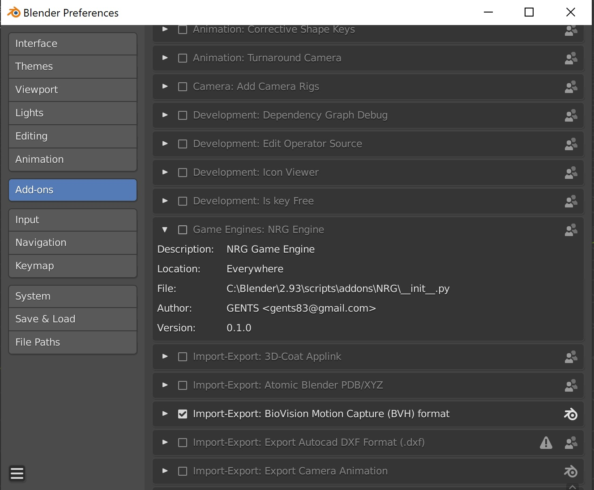

# Getting Started

In this page you'll find info related to:

## How to setup _**Blender**_ add-on

Every time that the code is updated a new version of the add-on is built and uploaded to the repository.
You can download latest version directly from [here](https://github.com/gents83/NRG/raw/gh-pages/INOX.zip)

Once that you downloaded it, you've two options install it or extract it in your _**Blender**_ add-on folder.
Usually the path is something like [Blender folder]/[version]/[scripts]/[addons

If you extracted it, you should have now an INOX folder inside your add-on folder:

## How to enable the _**INOX**_ addon directly in _**Blender**_

You should go in the Add-ons panel and enable the _**INOX**_ add-on

If you want to install it you've to choose the **INOX.zip** file that you've downloaded and install it.

Or if you've extracted the _**INOX**_ folder inside the Blender add-on folder, you should already have it into the addons list. \
You've to enable it in the _**Blender**_ preferences \
Once enabled please remember to setup add-on parameters, like the folder where you've the _**INOX**_ binaries. This step is mainly available to allow users to have __**INOX**__ binaries in a different folder, if needed (as example for the one working directly in code could be useful to set it to build output directory).

## How to use the _**INOX**_ addon in _**Blender**_

Once that the _**INOX**_ add-on is enabled and correctly setup, you should be able to edit your scene and run the _**INOX**_ viewer just pressing **F5** or going in the _Render Properties_ panel and pressing **Run in INOX** button under the _SABI_ dropdown tab:

